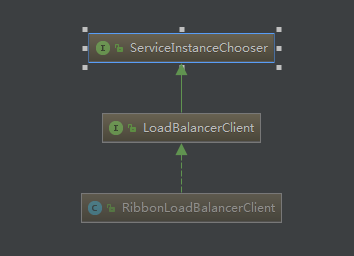
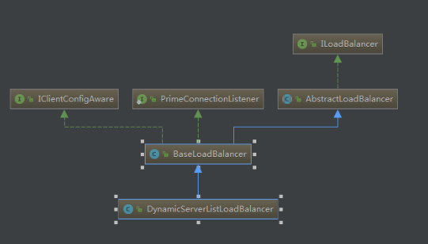
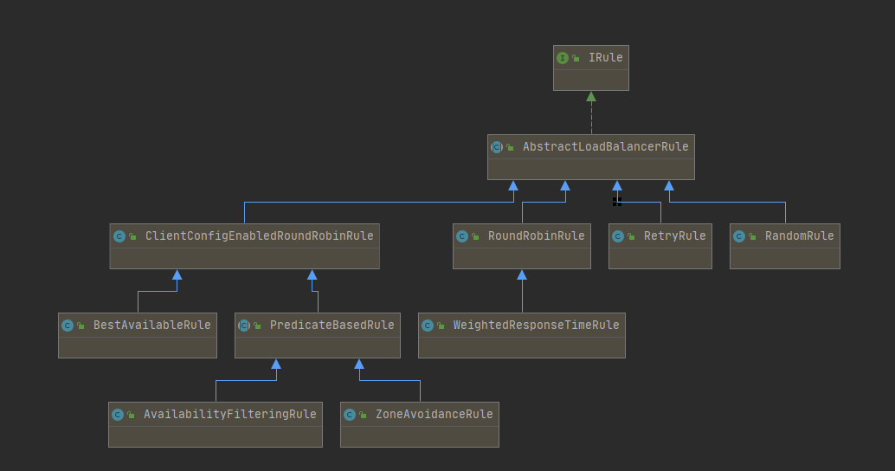
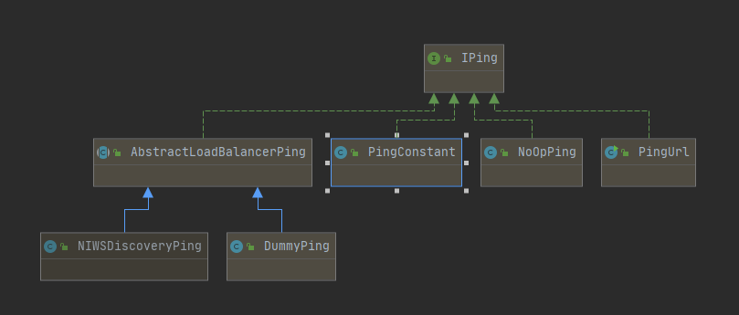

# 说明

### 本项目示例：服务消费者——api

>  SpringBoot项目，服务消费者，消费spring-cloud-provider-user提供的服务

### 一、项目说明

1. 项目使用ribbon和Hystrix分别实现服务调用的客户端负载均衡和熔断功能

2. 由于这里项目之间的调用是通过RestTemplate实现的，所以将负载均衡加注到RestTemplate上

3. ribbon默认采用的是RoundRobinRule——轮训策略，可以进行手动调整策略

   - 配置文件方式：

     ```
     #配置文件方式指定某个服务提供者的负载均衡策略
       SPRING-CLOUD-PROVIDER-USER:
         ribbon:
           NFLoadBalancerRuleClassName: com.netflix.loadbalancer.RandomRule
     ```

    - javaBean方式：

      ```
      //更换客户端负载均衡策略，也可以在配置文件中指定服务的负载均衡策略
      @Bean
      public IRule iRule(){
          return new RandomRule();
      }
      ```

4. 自定义负载均衡策略方式：

   - 自定义ribbon负载均衡策略，分两步：

   - 实现 AbstractLoadBalancerRule 类

   - 重写 choose 方法

   - 代码如下：

     ```
     /**
      * 自定义ribbon负载均衡策略
      */
     public class CustomRule extends AbstractLoadBalancerRule {
         /**
          * 总共被调用的次数，目前要求每台被调用4次
          */
         private int total = 0;
         /**
          * 当前提供服务列表的索引
          */
         private int currentIndex = 0;
         @Override
         public void initWithNiwsConfig(IClientConfig iClientConfig) {
         }
         /**
          * 在choose方法中，自定义我们自己的规则，返回的Server就是具体选择出来的服务
          * 自己的规则：按照轮询的规则，但是每个被轮询到的服务调用5次。
          *
          * @param o
          * @return
          */
         @Override
         public Server choose(Object o) {
             //[1] 获取负载均衡器lb
             ILoadBalancer lb = getLoadBalancer();
             if (lb == null) {
                 return null;
             }
             Server server = null;
             while (server == null) {
                 if (Thread.interrupted()) {
                     return null;
                 }
                 //[2] 获取可用服务列表
                 List<Server> upList = lb.getReachableServers();
                 //[3] 获取所有服务列表
                 List<Server> allList = lb.getAllServers();
                 int serverCount = allList.size();
                 if (serverCount == 0) {
                     return null;
                 }
                 //[4] 若调用次数小于4次，一直调用可用服务列表中索引为 currentIndex 的服务
                 if (total < 4) {
                     //这边做数组越界判断是为了防止，服务提供者如果一个下线了，那个这边的currentIndex可能会取到不存在的服务
                     if(upList.size() < currentIndex){
                         server = upList.get(currentIndex);
                         total++;
                     }else{
                         currentIndex = currentIndex % upList.size();
                         server = upList.get(currentIndex);
                         total = 0;
                     }
                 } else {
                     // 到了4次之后，服务列表中的索引值++，表示下一个调用下一个服务
                     total = 0;
                     currentIndex++;
                     // 当索引大于可用服务列表的size时，要重新从头开始
                     currentIndex = currentIndex % upList.size();
                     if (server == null) {
                         Thread.yield();
                         continue;
                     }
                     if (server.isAlive()) {
                         return (server);
                     }
                     server = null;
                     Thread.yield();
                 }
             }
             return server;
         }
     }
     ```

5. 较底层的服务如果出现故障，会导致连锁故障。当对特定的服务的调用的不可用达到一个阀值（Hystrix是5秒20次）断路器将会被打开,断路打开后，可用避免连锁故障，fallback方法可以直接返回一个固定值

6. Hystrix熔断器配置主要通过@HystrixCommand注解实现，通过设置fallback方法来进行熔断降级

7. 项目启动

   - 引入ribbon和hystrix依赖

     ```
     <!--客户端负载均衡器-->
               <dependency>
                   <groupId>org.springframework.cloud</groupId>
                   <artifactId>spring-cloud-starter-netflix-ribbon</artifactId>
               </dependency>
       
               <!-- 服务消费者中加入断路器 hystrix监控-->
               <dependency>
                   <groupId>org.springframework.cloud</groupId>
                   <artifactId>spring-cloud-starter-netflix-hystrix</artifactId>
               </dependency>
     ```

   - 启动类添加相关注解

     ```
      @SpringBootApplication
           //声明此服务是服务消费者
           @EnableDiscoveryClient
           //开启断路器功能
           @EnableCircuitBreaker
           public class SpringCloudAppApiApplication {
           
               //实现客户端负载均衡
               @LoadBalanced
               @Bean
               RestTemplate restTemplate() {
                   return new RestTemplate();
               }
           
               //更换客户端负载均衡策略，也可以在配置文件中指定服务的负载均衡策略
               @Bean
               public IRule iRule(){
                   return new RandomRule();
               }
           
           
               public static void main(String[] args) {
                   SpringApplication.run(SpringCloudAppApiApplication.class, args);
               }
           
           }
     ```

   - 需要配合微服务spring-cloud-provider-user集群部署，然后多次访问本服务，看是否能实现特定策略的负载均衡，对于熔断器测试，只需shutdown一个user服务，然后在请求，会执行快速失败，直接返回fallback结果，而不是等待响应超时，这很好的控制了容器的线程阻塞

   - 下面是@HystrixCommand注解的配置参数详解

     ```
     @HystrixCommand(commandKey = "testCommand", groupKey = "testGroup", threadPoolKey = "testThreadKey",
                 fallbackMethod = "hiConsumerFallBack", ignoreExceptions = {NullPointerException.class}, 
                 commandProperties={@HystrixProperty(name="execution.isolation.strategy",value = "THREAD")},
                 threadPoolProperties = {
                         @HystrixProperty(name = "coreSize", value = "30"),
                         @HystrixProperty(name = "maxQueueSize", value = "101"),
                         @HystrixProperty(name = "keepAliveTimeMinutes", value = "2"),
                         @HystrixProperty(name = "queueSizeRejectionThreshold", value = "15"),
                         @HystrixProperty(name = "metrics.rollingStats.numBuckets", value = "12"),
                         @HystrixProperty(name = "metrics.rollingStats.timeInMilliseconds", value = "1440")
                 }
                 )
     ```

     - commandKey：配置全局唯一标识服务的名称，比如，库存系统有一个获取库存服务，那么就可以为这个服务起一个名字来唯一识别该服务，如果不配置，则默认是@HystrixCommand注解修饰的函数的函数名
     - groupKey：一个比较重要的注解，配置全局唯一标识服务分组的名称。通过设置分组，Hystrix会根据组来组织和统计命令的告、仪表盘等信息。Hystrix命令默认的线程划分也是根据命令组来实现。默认情况下，Hystrix会让相同组名的命令使用同一个线程池，所以我们需要在创建Hystrix命令时为其指定命令组来实现默认的线程池划分。此外，Hystrix还提供了通过设置threadPoolKey来对线程池进行设置。建议最好设置该参数，使用threadPoolKey来控制线程池组。
     - threadPoolKey：对线程池进行设定，细粒度的配置，相当于对单个服务的线程池信息进行设置，也可多个服务设置同一个threadPoolKey构成线程组。
     - fallbackMethod：@HystrixCommand注解修饰的函数的回调函数，@HystrixCommand修饰的函数必须和这个回调函数定义在同一个类中，因为定义在了同一个类中，所以fackback method可以是public/private均可。
     - commandProperties：配置该命令的一些参数，如executionIsolationStrategy配置执行隔离策略，默认是使用线程隔离，此处我们配置为THREAD，即线程池隔离。参见：com.netflix.hystrix.HystrixCommandProperties中各个参数的定义。
     - threadPoolProperties：线程池相关参数设置，具体可以设置哪些参数请见：com.netflix.hystrix.HystrixThreadPoolProperties
     - ignoreExceptions：调用服务时，除了HystrixBadRequestException之外，其他@HystrixCommand修饰的函数抛出的异常均会被Hystrix认为命令执行失败而触发服务降级的处理逻辑（调用fallbackMethod指定的回调函数），所以当需要在命令执行中抛出不触发降级的异常时来使用它，通过这个参数指定，哪些异常抛出时不触发降级（不去调用fallbackMethod），而是将异常向上抛出。
     - observableExecutionMode：定义hystrix observable command的模式；
     - raiseHystrixExceptions：任何不可忽略的异常都包含在HystrixRuntimeException中；
     - defaultFallback：默认的回调函数，该函数的函数体不能有入参，返回值类型与@HystrixCommand修饰的函数体的返回值一致。如果指定了fallbackMethod，则fallbackMethod优先级更高。

### 二、ribbon源码学习

1. 什么是ribbon?
   - Ribbon是`Netflix`公司开源的一个负载均衡的项目，是一个客户端负载均衡器，运行在客户端上，这边所谓的客户端，是针对于服务提供者来说，服务调用者就是客户端

2. RestTemplate和Ribbon相结合

   - 在feign中默认使用了ribbon，在zuul中也是使用ribbon做负载均衡，在springcloud中，做的最多的就是将RestTemplate和ribbon结合：	

     ```
     @LoadBalanced
           @Bean
           RestTemplate restTemplate() {
               return new RestTemplate();
           }
     ```

   - 消费另外一个服务的接口，使用如下方式：

     ```
      @Autowired
           private RestTemplate restTemplate;
       
           protected String dealGetServer(String url,Map<String,Object> paramVariables) {
       
               StringBuilder sb = new StringBuilder(64);
       
               // 封装必要参数
               sb.append(url).append("?timestamp=").append(System.currentTimeMillis());
       
               if(MapUtils.isNotEmpty(paramVariables)){
                   paramVariables.entrySet().stream().forEach(entry -> sb.append("&").append(entry.getKey()).append("=").append(entry.getValue()));
               }
       
               return restTemplate.getForObject(sb.toString(), String.class);
           }
     ```

3. 深入理解ribbon

  - LoadBalancerClient

    - 在Ribbon中一个非常重要的组件为LoadBalancerClient，它作为负载均衡的一个客户端

    - 存放在spring-cloud-commons包下，LoadBalancerClient是一个接口，它继承ServiceInstanceChooser，它的实现类是RibbonLoadBalancerClient

    - 三者关系如下：
      

    - 在LoadBalancerClient接口中定义了三个方法，其中execute()是执行请求，reconstructURI()用来重构url：

      ```java
          public interface LoadBalancerClient extends ServiceInstanceChooser {
              <T> T execute(String serviceId, LoadBalancerRequest<T> request) throws IOException;
          
              <T> T execute(String serviceId, ServiceInstance serviceInstance, LoadBalancerRequest<T> request) throws IOException;
          
              URI reconstructURI(ServiceInstance instance, URI original);
          }
      ```

    - ServiceInstanceChooser接口，存放在spring-cloud-commons包下，就一个方法用来根据serviceId选取ServiceInstance：

      ```java
           public interface ServiceInstanceChooser {
               ServiceInstance choose(String serviceId);
           }
      ```

    - LoadBalancerClient的一个实现类是RibbonLoadBalancerClient，是ribbon包org.springframework.cloud.netflix.ribbon下的一个实现类

    - RibbonLoadBalancerClient是非常重要的一个类，最终的负载均衡的请求处理，由它来执行，其部分源码如下：

      > 其中choose()方法是选择具体服务实例的一个方法。该方法通过getServer()方法去获取实例，经过源码跟踪，最终交给了ILoadBalancer类去选择服务实例

      ```java
           public class RibbonLoadBalancerClient implements LoadBalancerClient {
               //省略部分...
         
               public ServiceInstance choose(String serviceId) {
                   return this.choose(serviceId, (Object)null);
               }
           
               public ServiceInstance choose(String serviceId, Object hint) {
                   Server server = this.getServer(this.getLoadBalancer(serviceId), hint);
                   return server == null ? null : new RibbonLoadBalancerClient.RibbonServer(serviceId, server, this.isSecure(server, serviceId), this.serverIntrospector(serviceId).getMetadata(server));
               }
           
               public <T> T execute(String serviceId, LoadBalancerRequest<T> request) throws IOException {
                   return this.execute(serviceId, (LoadBalancerRequest)request, (Object)null);
               }
           
               public <T> T execute(String serviceId, LoadBalancerRequest<T> request, Object hint) throws IOException {
                   ILoadBalancer loadBalancer = this.getLoadBalancer(serviceId);
                   Server server = this.getServer(loadBalancer, hint);
                   if (server == null) {
                       throw new IllegalStateException("No instances available for " + serviceId);
                   } else {
                       RibbonLoadBalancerClient.RibbonServer ribbonServer = new RibbonLoadBalancerClient.RibbonServer(serviceId, server, this.isSecure(server, serviceId), this.serverIntrospector(serviceId).getMetadata(server));
                       return this.execute(serviceId, (ServiceInstance)ribbonServer, (LoadBalancerRequest)request);
                   }
               }
           
               public <T> T execute(String serviceId, ServiceInstance serviceInstance, LoadBalancerRequest<T> request) throws IOException {
                   Server server = null;
                   if (serviceInstance instanceof RibbonLoadBalancerClient.RibbonServer) {
                       server = ((RibbonLoadBalancerClient.RibbonServer)serviceInstance).getServer();
                   }
           
                   if (server == null) {
                       throw new IllegalStateException("No instances available for " + serviceId);
                   } else {
                       RibbonLoadBalancerContext context = this.clientFactory.getLoadBalancerContext(serviceId);
                       RibbonStatsRecorder statsRecorder = new RibbonStatsRecorder(context, server);
           
                       try {
                           T returnVal = request.apply(serviceInstance);
                           statsRecorder.recordStats(returnVal);
                           return returnVal;
                       } catch (IOException var8) {
                           statsRecorder.recordStats(var8);
                           throw var8;
                       } catch (Exception var9) {
                           statsRecorder.recordStats(var9);
                           ReflectionUtils.rethrowRuntimeException(var9);
                           return null;
                       }
                   }
               }
           
               private ServerIntrospector serverIntrospector(String serviceId) {
                   ServerIntrospector serverIntrospector = (ServerIntrospector)this.clientFactory.getInstance(serviceId, ServerIntrospector.class);
                   if (serverIntrospector == null) {
                       serverIntrospector = new DefaultServerIntrospector();
                   }
           
                   return (ServerIntrospector)serverIntrospector;
               }
           
               private boolean isSecure(Server server, String serviceId) {
                   IClientConfig config = this.clientFactory.getClientConfig(serviceId);
                   ServerIntrospector serverIntrospector = this.serverIntrospector(serviceId);
                   return RibbonUtils.isSecure(config, serverIntrospector, server);
               }
           
               protected Server getServer(String serviceId) {
                   return this.getServer(this.getLoadBalancer(serviceId), (Object)null);
               }
           
               protected Server getServer(ILoadBalancer loadBalancer) {
                   return this.getServer(loadBalancer, (Object)null);
               }
           
               protected Server getServer(ILoadBalancer loadBalancer, Object hint) {
                   return loadBalancer == null ? null : loadBalancer.chooseServer(hint != null ? hint : "default");
               }
           
               protected ILoadBalancer getLoadBalancer(String serviceId) {
                   return this.clientFactory.getLoadBalancer(serviceId);
               }
               //省略部分...
           
           }
      ```

    - ILoadBalancer：在ribbon-loadbalancer的jar包下，它是定义了实现软件负载均衡的一个接口，它需要一组可供选择的服务注册列表信息，以及根据特定方法去选择服务

    - ILoadBalancer的源码如下：

      ```java
           public interface ILoadBalancer {
               // addServers()方法是添加一个Server集合
               void addServers(List<Server> var1);
         
               // chooseServer()方法是根据key去获取Server
               Server chooseServer(Object var1);
               
               // markServerDown()方法用来标记某个服务下线
               void markServerDown(Server var1);
           
               /** @deprecated */
               @Deprecated
               List<Server> getServerList(boolean var1);
               
               // getReachableServers()获取可用的Server集合
               List<Server> getReachableServers();
           
               // getAllServers()获取所有的Server集合
               List<Server> getAllServers();
           }
      ```

  - DynamicServerListLoadBalancer

    - DynamicServerListLoadBalancer继承BaseLoadBalancer

    - 关系如下：
      

    - 查看BaseLoadBalancer类，默认情况下，它实现了以下配置：

      - IClientConfig ribbonClientConfig: DefaultClientConfigImpl配置
      - IRule ribbonRule: RoundRobinRule 路由策略
      - IPing ribbonPing: DummyPing
      - ServerList ribbonServerList: ConfigurationBasedServerList
      - ServerListFilter ribbonServerListFilter: ZonePreferenceServerListFilter
      - ILoadBalancer ribbonLoadBalancer: ZoneAwareLoadBalancer

    - IClientConfig

      - IClientConfig 用于对客户端或者负载均衡的配置，它的默认实现类为DefaultClientConfigImpl

    - IRule

      - IRule用于复杂均衡的策略，它有三个方法，其中choose()是根据key 来获取server,setLoadBalancer()和getLoadBalancer()是用来设置和获取ILoadBalancer的

      - 源码：

        ```java
              public interface IRule {
                  Server choose(Object var1);
              
                  void setLoadBalancer(ILoadBalancer var1);
              
                  ILoadBalancer getLoadBalancer();
              }
        ```

      - IRule有很多默认的实现类，这些实现类根据不同的算法和逻辑来处理负载均衡,Ribbon实现的IRule有以下：

        - BestAvailableRule 选择最小请求数
        - ClientConfigEnabledRoundRobinRule 轮询
        - RandomRule 随机选择一个server
        - RoundRobinRule 轮询选择server
        - RetryRule 根据轮询的方式重试
        - WeightedResponseTimeRule 根据响应时间去分配一个weight ，weight越低，被选择的可能性就越低
        - ZoneAvoidanceRule 根据server的zone区域和可用性来轮询选择   

      - IRule的实现类图
        

      - IPing是用来想server发生”ping”，来判断该server是否有响应，从而判断该server是否可用

      - 它只有一个isAlive()方法，它的源码如下:

        ```java
              public interface IPing {
                  boolean isAlive(Server var1);
              }
        ```

      - IPing的实现类有PingUrl、PingConstant、NoOpPing、DummyPing和NIWSDiscoveryPing，他们之间的关系如下：
        

        - PingUrl 真实的去ping 某个url，判断其是否alive
        - PingConstant 固定返回某服务是否可用，默认返回true，即可用
        - NoOpPing 不去ping,直接返回true,即可用
        - DummyPing 直接返回true，并实现了initWithNiwsConfig方法
        - NIWSDiscoveryPing，根据DiscoveryEnabledServer的InstanceInfo的InstanceStatus去判断，如果为InstanceStatus.UP，则为可用，否则不可用

    - ServerList

      - ServerList是定义获取所有的server的注册列表信息的接口，它的代码如下：  

        ```java
          public interface ServerList<T extends Server> {
          
              public List<T> getInitialListOfServers();
              public List<T> getUpdatedListOfServers();   
          
          }
        ```

    - ServerListFilter

      - ServerListFilter接口，定义了可根据配置去过滤或者根据特性动态获取符合条件的server列表的方法，代码如下：

        ```java
          public interface ServerListFilter<T extends Server> {
          
              public List<T> getFilteredListOfServers(List<T> servers);
          
          }
        ```

    - DynamicServerListLoadBalancer

      - 再回过头来看DynamicServerListLoadBalancer的源码，它的构造函数中有个initWithNiwsConfig()方法

      - 关键代码：

        ```java
              public DynamicServerListLoadBalancer(IClientConfig clientConfig) {
                      this.isSecure = false;
                      this.useTunnel = false;
                      this.serverListUpdateInProgress = new AtomicBoolean(false);
              
                      class NamelessClass_1 implements UpdateAction {
                          NamelessClass_1() {
                          }
              
                          public void doUpdate() {
                              DynamicServerListLoadBalancer.this.updateListOfServers();
                          }
                      }
              
                      this.updateAction = new NamelessClass_1();
                      this.initWithNiwsConfig(clientConfig);
                  }
              
                  public void initWithNiwsConfig(IClientConfig clientConfig) {
                      try {
                          super.initWithNiwsConfig(clientConfig);
                          String niwsServerListClassName = clientConfig.getPropertyAsString(CommonClientConfigKey.NIWSServerListClassName, "com.netflix.loadbalancer.ConfigurationBasedServerList");
                          ServerList<T> niwsServerListImpl = (ServerList)ClientFactory.instantiateInstanceWithClientConfig(niwsServerListClassName, clientConfig);
                          this.serverListImpl = niwsServerListImpl;
                          if (niwsServerListImpl instanceof AbstractServerList) {
                              AbstractServerListFilter<T> niwsFilter = ((AbstractServerList)niwsServerListImpl).getFilterImpl(clientConfig);
                              niwsFilter.setLoadBalancerStats(this.getLoadBalancerStats());
                              this.filter = niwsFilter;
                          }
              
                          String serverListUpdaterClassName = clientConfig.getPropertyAsString(CommonClientConfigKey.ServerListUpdaterClassName, "com.netflix.loadbalancer.PollingServerListUpdater");
                          this.serverListUpdater = (ServerListUpdater)ClientFactory.instantiateInstanceWithClientConfig(serverListUpdaterClassName, clientConfig);
                          this.restOfInit(clientConfig);
                      } catch (Exception var5) {
                          throw new RuntimeException("Exception while initializing NIWSDiscoveryLoadBalancer:" + clientConfig.getClientName() + ", niwsClientConfig:" + clientConfig, var5);
                      }
                  }
              
                  void restOfInit(IClientConfig clientConfig) {
                      boolean primeConnection = this.isEnablePrimingConnections();
                      this.setEnablePrimingConnections(false);
                      this.enableAndInitLearnNewServersFeature();
                      this.updateListOfServers();
                      if (primeConnection && this.getPrimeConnections() != null) {
                          this.getPrimeConnections().primeConnections(this.getReachableServers());
                      }
              
                      this.setEnablePrimingConnections(primeConnection);
                      LOGGER.info("DynamicServerListLoadBalancer for client {} initialized: {}", clientConfig.getClientName(), this.toString());
                  }
        
                  @VisibleForTesting
                  public void updateListOfServers() {
                      List<T> servers = new ArrayList();
                      if (this.serverListImpl != null) {
                          servers = this.serverListImpl.getUpdatedListOfServers();
                          LOGGER.debug("List of Servers for {} obtained from Discovery client: {}", this.getIdentifier(), servers);
                          if (this.filter != null) {
                              servers = this.filter.getFilteredListOfServers((List)servers);
                              LOGGER.debug("Filtered List of Servers for {} obtained from Discovery client: {}", this.getIdentifier(), servers);
                          }
                      }
              
                      this.updateAllServerList((List)servers);
                  }
        ```

      - 在initWithNiwsConfig()方法中，经过一系列的初始化配置，最终执行了restOfInit()方法，

      - 在restOfInit()方法上，有一个 updateListOfServers()的方法，该方法是用来获取所有的ServerList的

      - 进一步跟踪updateListOfServers()方法的源码，最终由serverListImpl.getUpdatedListOfServers()获取所有的服务列表的

      - 而serverListImpl是ServerList接口的具体实现类。跟踪代码，ServerList的实现类为DiscoveryEnabledNIWSServerList，在ribbon-eureka.jar的com.netflix.niws.loadbalancer下

      - DiscoveryEnabledNIWSServerList有 getInitialListOfServers()和getUpdatedListOfServers()方法，这两个方法都调用了obtainServersViaDiscovery()方法，源码如下：

        ```java
                  public List<DiscoveryEnabledServer> getInitialListOfServers() {
                      return this.obtainServersViaDiscovery();
                  }
              
                  public List<DiscoveryEnabledServer> getUpdatedListOfServers() {
                      return this.obtainServersViaDiscovery();
                  }
                  private List<DiscoveryEnabledServer> obtainServersViaDiscovery() {
                      List<DiscoveryEnabledServer> serverList = new ArrayList();
                      if (this.eurekaClientProvider != null && this.eurekaClientProvider.get() != null) {
                          EurekaClient eurekaClient = (EurekaClient)this.eurekaClientProvider.get();
                          if (this.vipAddresses != null) {
                              String[] var3 = this.vipAddresses.split(",");
                              int var4 = var3.length;
              
                              for(int var5 = 0; var5 < var4; ++var5) {
                                  String vipAddress = var3[var5];
                                  List<InstanceInfo> listOfInstanceInfo = eurekaClient.getInstancesByVipAddress(vipAddress, this.isSecure, this.targetRegion);
                                  Iterator var8 = listOfInstanceInfo.iterator();
              
                                  while(var8.hasNext()) {
                                      InstanceInfo ii = (InstanceInfo)var8.next();
                                      if (ii.getStatus().equals(InstanceStatus.UP)) {
                                          if (this.shouldUseOverridePort) {
                                              if (logger.isDebugEnabled()) {
                                                  logger.debug("Overriding port on client name: " + this.clientName + " to " + this.overridePort);
                                              }
              
                                              InstanceInfo copy = new InstanceInfo(ii);
                                              if (this.isSecure) {
                                                  ii = (new Builder(copy)).setSecurePort(this.overridePort).build();
                                              } else {
                                                  ii = (new Builder(copy)).setPort(this.overridePort).build();
                                              }
                                          }
              
                                          DiscoveryEnabledServer des = this.createServer(ii, this.isSecure, this.shouldUseIpAddr);
                                          serverList.add(des);
                                      }
                                  }
              
                                  if (serverList.size() > 0 && this.prioritizeVipAddressBasedServers) {
                                      break;
                                  }
                              }
                          }
              
                          return serverList;
                      } else {
                          logger.warn("EurekaClient has not been initialized yet, returning an empty list");
                          return new ArrayList();
                      }
                  }
        ```

      - obtainServersViaDiscovery()是根据eurekaClientProvider.get()来获取EurekaClient，再根据EurekaClient来获取注册列表信息

      - 其中eurekaClientProvider的实现类是LegacyEurekaClientProvider，它是一个获取eurekaClient类，通过静态的方法去获取eurekaClient，其代码如下：

        ```java
          class LegacyEurekaClientProvider implements Provider<EurekaClient> {
              private volatile EurekaClient eurekaClient;
          
              LegacyEurekaClientProvider() {
              }
          
              public synchronized EurekaClient get() {
                  if (this.eurekaClient == null) {
                      this.eurekaClient = DiscoveryManager.getInstance().getDiscoveryClient();
                  }
          
                  return this.eurekaClient;
              }
          }
        ```

      - EurekaClient的实现类为DiscoveryClient，在之前已经分析了它具有服务注册、获取服务注册列表等的全部功能

      - 由此可见，负载均衡器是从EurekaClient获取服务信息，并根据IRule去路由，并且根据IPing去判断服务的可用性

      - 那么负载均衡器多久一次去获取一次从Eureka Client获取注册信息呢？

        - 在BaseLoadBalancer类下，BaseLoadBalancer的构造函数，该构造函数开启了一个PingTask任务，setupPingTask()，源码如下：

          ```java
                void setupPingTask() {
                    if (!this.canSkipPing()) {
                        if (this.lbTimer != null) {
                            this.lbTimer.cancel();
                        }
            
                        this.lbTimer = new ShutdownEnabledTimer("NFLoadBalancer-PingTimer-" + this.name, true);
                        this.lbTimer.schedule(new BaseLoadBalancer.PingTask(), 0L, (long)(this.pingIntervalSeconds * 1000));
                        this.forceQuickPing();
                    }
                }
          ```

      - 其中PingTask源码，即new一个Pinger对象，并执行runPinger()方法：

        ```java
                  class PingTask extends TimerTask {
                      PingTask() {
                      }
              
                      public void run() {
                          try {
                              (BaseLoadBalancer.this.new Pinger(BaseLoadBalancer.this.pingStrategy)).runPinger();
                          } catch (Exception var2) {
                              BaseLoadBalancer.logger.error("LoadBalancer [{}]: Error pinging", BaseLoadBalancer.this.name, var2);
                          }
              
                      }
                  }
        ```

      - 查看Pinger的runPinger()方法，最终根据 pingerStrategy.pingServers(ping, allServers)来获取服务的可用性，如果该返回结果，如之前相同，则不去向EurekaClient获取注册列表，如果不同则通知ServerStatusChangeListener或者changeListeners发生了改变，进行更新或者重新拉取

        ```java
              public void runPinger() throws Exception {
                          if (BaseLoadBalancer.this.pingInProgress.compareAndSet(false, true)) {
                              Server[] allServers = null;
                              boolean[] results = null;
                              Lock allLock = null;
                              Lock upLock = null;
              
                              try {
                                  allLock = BaseLoadBalancer.this.allServerLock.readLock();
                                  allLock.lock();
                                  allServers = (Server[])BaseLoadBalancer.this.allServerList.toArray(new Server[BaseLoadBalancer.this.allServerList.size()]);
                                  allLock.unlock();
                                  int numCandidates = allServers.length;
                                  boolean[] resultsx = this.pingerStrategy.pingServers(BaseLoadBalancer.this.ping, allServers);
                                  List<Server> newUpList = new ArrayList();
                                  List<Server> changedServers = new ArrayList();
              
                                  for(int i = 0; i < numCandidates; ++i) {
                                      boolean isAlive = resultsx[i];
                                      Server svr = allServers[i];
                                      boolean oldIsAlive = svr.isAlive();
                                      svr.setAlive(isAlive);
                                      if (oldIsAlive != isAlive) {
                                          changedServers.add(svr);
                                          BaseLoadBalancer.logger.debug("LoadBalancer [{}]:  Server [{}] status changed to {}", new Object[]{BaseLoadBalancer.this.name, svr.getId(), isAlive ? "ALIVE" : "DEAD"});
                                      }
              
                                      if (isAlive) {
                                          newUpList.add(svr);
                                      }
                                  }
              
                                  upLock = BaseLoadBalancer.this.upServerLock.writeLock();
                                  upLock.lock();
                                  BaseLoadBalancer.this.upServerList = newUpList;
                                  upLock.unlock();
                                  BaseLoadBalancer.this.notifyServerStatusChangeListener(changedServers);
                              } finally {
                                  BaseLoadBalancer.this.pingInProgress.set(false);
                              }
                          }
                      }
                  }
        ```

      - 由此可见，LoadBalancerClient是在初始化的时候，会向Eureka回去服务注册列表，并且向通过10s一次向EurekaClient发送“ping”，来判断服务的可用性，如果服务的可用性发生了改变或者服务数量和之前的不一致，则更新或者重新拉取。LoadBalancerClient有了这些服务注册列表，就可以根据具体的IRule来进行负载均衡

4. RestTemplate是如何和Ribbon结合的

> 为什么在RestTemplate加一个@LoadBalance注解就可可以开启负载均衡呢？
>
> - 找到类LoadBalancerAutoConfiguration，即LoadBalancer自动配置类，部分源码如下：
>
>   ```java
>     @Configuration(
>         proxyBeanMethods = false
>     )
>     @ConditionalOnClass({RestTemplate.class})
>     @ConditionalOnBean({LoadBalancerClient.class})
>     @EnableConfigurationProperties({LoadBalancerRetryProperties.class})
>     public class LoadBalancerAutoConfiguration {
>         @LoadBalanced
>         @Autowired(
>             required = false
>         )
>         private List<RestTemplate> restTemplates = Collections.emptyList();
>         @Bean
>         public SmartInitializingSingleton loadBalancedRestTemplateInitializerDeprecated(final ObjectProvider<List<RestTemplateCustomizer>> restTemplateCustomizers) {
>             return () -> {
>                 restTemplateCustomizers.ifAvailable((customizers) -> {
>                     Iterator var2 = this.restTemplates.iterator();
>   ```

```
                    while(var2.hasNext()) {
                        RestTemplate restTemplate = (RestTemplate)var2.next();
                        Iterator var4 = customizers.iterator();
    
                        while(var4.hasNext()) {
                            RestTemplateCustomizer customizer = (RestTemplateCustomizer)var4.next();
                            customizer.customize(restTemplate);
                        }
                    }
    
                });
            };
        }
        @Configuration(
            proxyBeanMethods = false
        )
        @ConditionalOnMissingClass({"org.springframework.retry.support.RetryTemplate"})
        static class LoadBalancerInterceptorConfig {
            LoadBalancerInterceptorConfig() {
            }
    
            @Bean
            public LoadBalancerInterceptor ribbonInterceptor(LoadBalancerClient loadBalancerClient, LoadBalancerRequestFactory requestFactory) {
                return new LoadBalancerInterceptor(loadBalancerClient, requestFactory);
            }
    
            @Bean
            @ConditionalOnMissingBean
            public RestTemplateCustomizer restTemplateCustomizer(final LoadBalancerInterceptor loadBalancerInterceptor) {
                return (restTemplate) -> {
                    List<ClientHttpRequestInterceptor> list = new ArrayList(restTemplate.getInterceptors());
                    list.add(loadBalancerInterceptor);
                    restTemplate.setInterceptors(list);
                };
            }
        }
    }
  ```
```

  - 在该类中，首先维护了一个被@LoadBalanced修饰的RestTemplate对象的List，在初始化的过程中，通过调用customizer.customize(restTemplate)方法来给RestTemplate增加拦截器LoadBalancerInterceptor

  - 而LoadBalancerInterceptor，用于实时拦截，在LoadBalancerInterceptor这里

  - 实现来负载均衡。LoadBalancerInterceptor的拦截方法如下:

    ```java
          public ClientHttpResponse intercept(final HttpRequest request, final byte[] body, final ClientHttpRequestExecution execution) throws IOException {
              URI originalUri = request.getURI();
              String serviceName = originalUri.getHost();
              Assert.state(serviceName != null, "Request URI does not contain a valid hostname: " + originalUri);
              return (ClientHttpResponse)this.loadBalancer.execute(serviceName, this.requestFactory.createRequest(request, body, execution));
          }
    ```

5. 总结

  - Ribbon的负载均衡，主要通过LoadBalancerClient来实现的

  - 而LoadBalancerClient具体交给了ILoadBalancer来处理

  - ILoadBalancer通过配置IRule、IPing等信息，并向EurekaClient获取注册列表的信息，并默认10秒一次向EurekaClient发送“ping”,进而检查是否更新服务列表

  - 最后，得到注册列表后，ILoadBalancer根据IRule的策略进行负载均衡

  - 而RestTemplate 被@LoadBalance注解后，能过用负载均衡，主要是维护了一个被@LoadBalance注解的RestTemplate列表，并给列表中的RestTemplate添加拦截器，进而交给负载均衡器去处理

    
